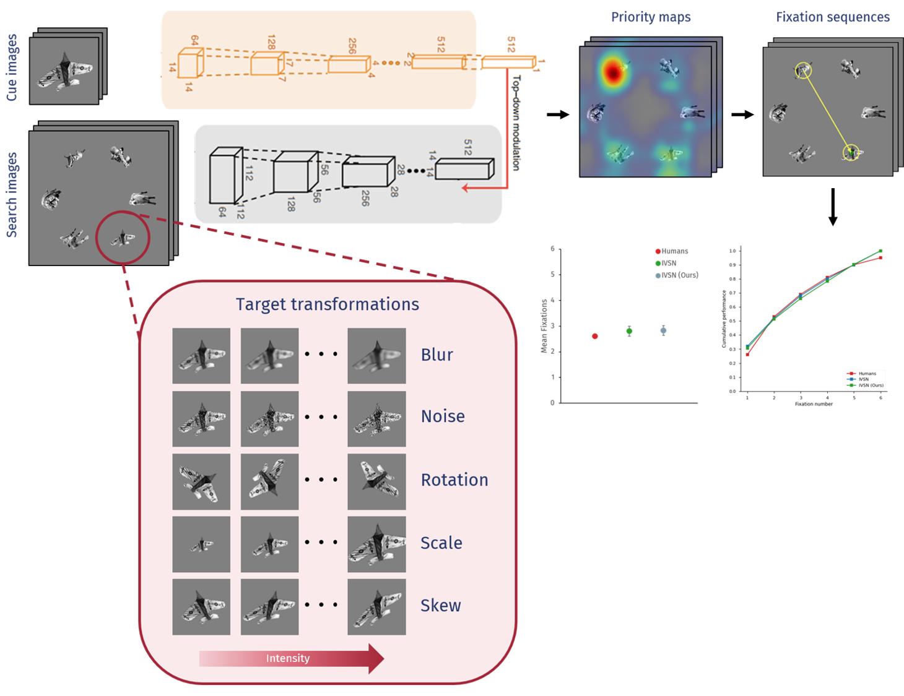
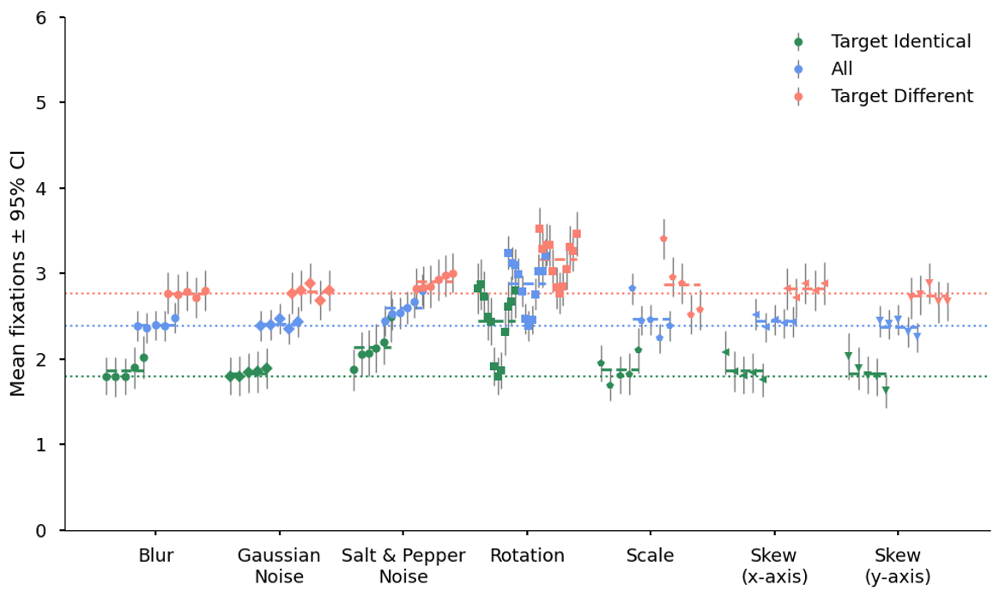
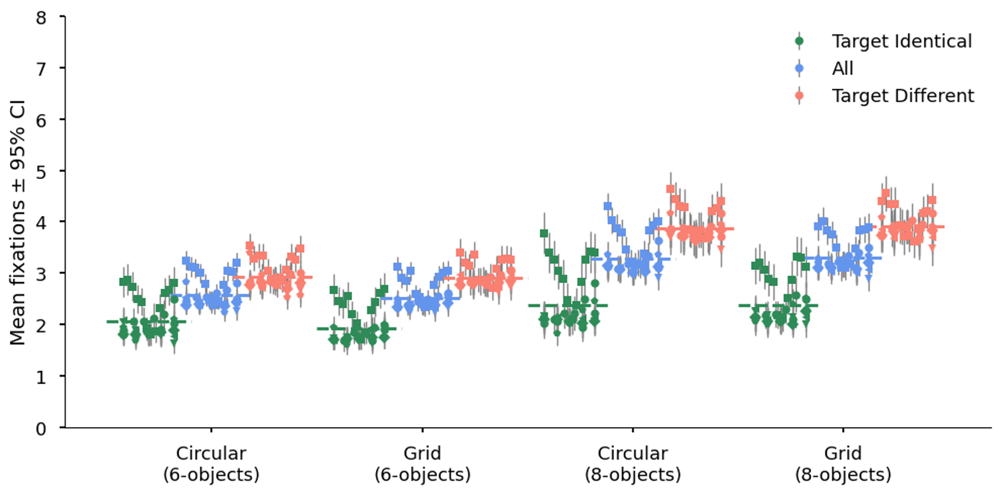
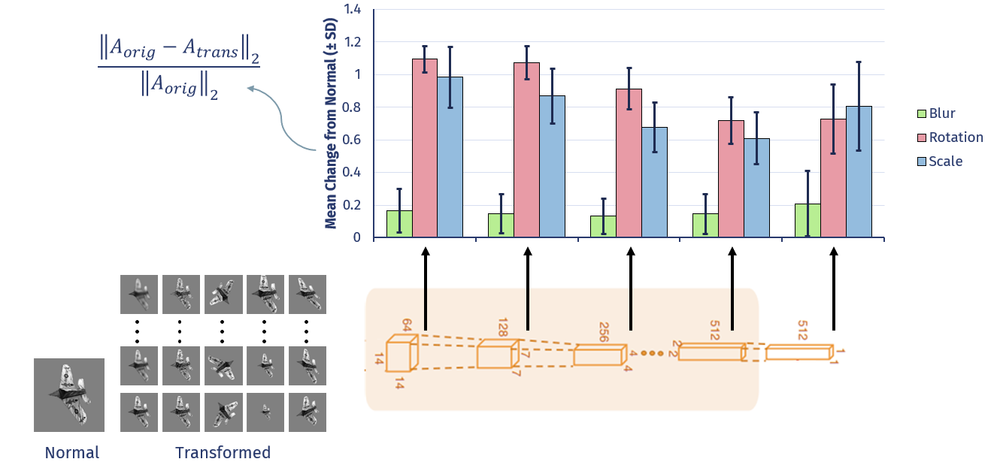
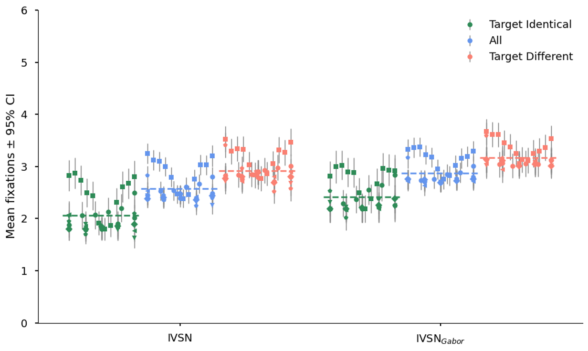
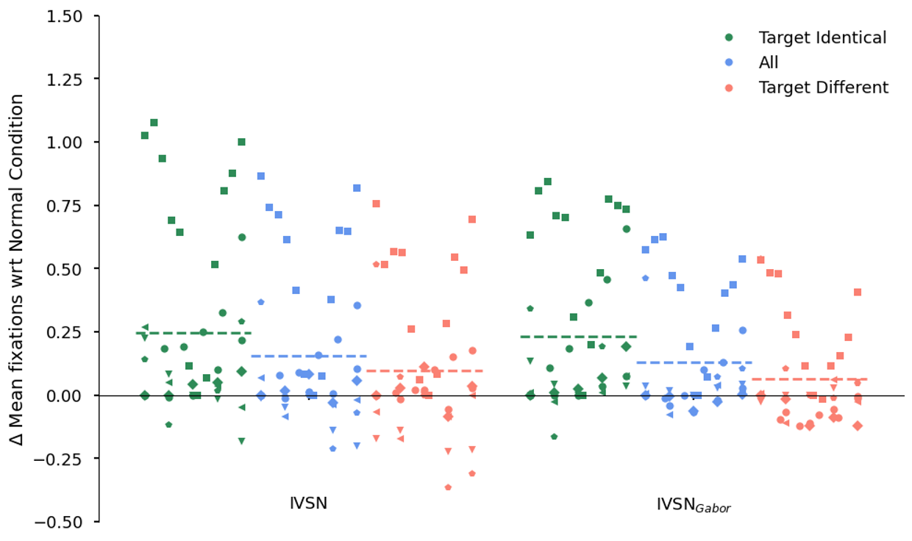

# Invariance properties of predicted eye movements in visual search models

## Abstract
We assess how geometric and photometric transformations affect predicted gaze patterns using computational models that generate fixation sequences via target-driven priority maps. We evaluated the IVSN model (Zhang et al., Nat. Comm., 2018) and a variant with the initial stages replaced by a Gabor filter bank ($\text{IVSN}_{Gabor}$). Object arrays display 6 or 8 objects arranged in circular or grid-like layouts, with transformations applied to the target object in the search image. The mean number of fixations to locate the target across 300 trials measures the performance. IVSN achieved stronger baseline performance (6-object array; 2.4 ± 1.6 vs. 2.7 ± 1.7), though $\text{IVSN}_{Gabor}$ was less impaired by transformations overall. Blur, noise, and skew did not affect either model but scale and rotation significantly degraded performance in both models, with IVSN performance at 180o rotation being close to random guessing (3.2 ± 1.7). Scale produced an asymmetric effect, with larger targets easier to locate than smaller ones (2.2 ± 1.5 vs 2.8 ± 1.6). Analysis of internal representations showed that the effect of transformations was smaller in higher layers of the models, suggesting that invariance develops over the course of processing in a hierarchical representation. These results show that the models are not equally invariant to all transformations. Distinct computational mechanisms may be necessary to achieve invariance across transformation types.

## Overview



Rotation and scale transformations have the strongest effect on IVSN performance.



Configuration type does not affect model performance.



Higher layer activations are less affected by transformations.



$\text{IVSN}_{Gabor}$ has worse baseline performance ...



... but slightly better invariance properties



## Installation
Python 3.8 or newer is recommended. Create and activate a virtual environment, then install the Python dependencies:

```bash
python -m venv .venv
source .venv/bin/activate       # Linux/macOS
# .venv\Scripts\activate        # Windows PowerShell
python -m pip install --upgrade pip
python -m pip install -r requirements.txt
```

$IVSN_{Gabor}$ model is based on the [ConvGist](https://github.com/atifkhurshid/convgist) framework. The `gist` package should be installed separately before running any experiments with this model. Installation instructions can be found [here](https://github.com/atifkhurshid/convgist#installation). The plain VGG model does not require this package to be installed.

Main third-party libraries:

- PyTorch and torchvision for neural-network backbones and inference
- NumPy for numerical operations
- Pillow for stimulus transformations and rendering
- Matplotlib and pandas for plots and tabular summaries

Choose PyTorch and torchvision builds that match your CUDA installation. For a
CPU-only run, pass `--device cpu`.

## Model weights

$\text{IVSN}_{Gabor}$ checkpoint is available in Releases (vgg_gist.pth). After cloning the repository, copy the available
weights into:

```text
codes/model_weights/
```

The default paths are resolved relative to the source files, not the current
working directory. The program therefore finds the weights whether it is started
from the repository root or from `codes/`. A custom location can still be passed
through the corresponding `--*-checkpoint` option.

## Dataset

The invariance experiment expects one folder per category below `--data-root`.
Each category folder must contain PNG images. Supported configurations contain
either six or eight categories:

```text
sheep, cattle, cats, horses, teddybears, kites[, birds, dogs]
```

The alias `teddy_bears` is also accepted for `teddybears`.

The dataset can be prepared by first downloading the [COCO dataset](https://cocodataset.org/#download) (2017 Train and Val) and then running the following script from the repository root.

```bash
python codes/coco/prepare_coco_dataset.py \
  --coco_dir /path/to/coco \
  --output_dir /path/to/dataset \
  --split both \
  --max_per_cat 300 \
  --min_area 2000 \
  --vis_samples 1 \
  --seed 42 \
```

## Running the invariance experiment

From the repository root:

```bash
python codes/ivsn_invariant_search.py \
  --data-root /path/to/dataset \
  --out-dir codes/outputs/rotation_vgg \
  --arrangement circle \
  --n-objects 6 \
  --transform-mode rotation \
  --rotation-values 0 90 \
  --jitter 0.2 \
  --smoothing-mode cosine \
  --edge-taper-width-px 3 \
  --smooth-target \
  --smooth-cue \
  --smooth-distractors \
  --model-kind vgg \
  --device cuda
```

The package entry point is equivalent when run from `codes/`:

```bash
cd codes
python -m ivsn_invariance --help
```

Available model kinds are `vgg` and `vgg_gist`.

## Outputs

Each experiment writes trial manifests, per-trial JSON/CSV results, grouped summaries, plots, and optional example visualizations in `--out-dir`.

## VGG feature-representation analysis

The feature-analysis entry point compares two search displays that are pixel-identical except for the target transformation. It measures corresponding target-region feature vectors at VGG layers 16, 23, and 30, using 5 x 5, 3 x 3, and 1 x 1 regions respectively. It also computes effective receptive fields (ERFs) by taking the absolute input gradient for each selected spatial cell and superimposing the resulting saliency maps.

```bash
python codes/analyze_vgg_features.py \
  --data-root /path/to/dataset \
  --out-dir codes/outputs/feature_rotation \
  --arrangement circle \
  --n-objects 6 \
  --transform-mode rotation \
  --rotation-values 0 90 \
  --jitter 0.2 \
  --smoothing-mode cosine \
  --edge-taper-width-px 3 \
  --smooth-target \
  --smooth-cue \
  --smooth-distractors \
  --model-kind vgg \
  --device cuda
```

The output contains:

- `feature_cell_distances.csv`: Euclidean, channel-normalized RMS Euclidean,
  and cosine distances for every corresponding spatial cell.
- `feature_trial_distances.csv`: target-region means for every trial and layer.
- `grouped_feature_distances.csv`: means and 95% confidence intervals for all,
  target-identical, and target-different trials.
- `plots/`: grouped bar charts for strict cellwise, pooled, and spatially
  tolerant feature distances.
- `cue_target_cell_metrics.csv`, `cue_target_trial_metrics.csv`, and
  `grouped_cue_target_metrics.csv`: comparisons between the pooled cue and the
  original/transformed search-target representation. These make the
  target-identical versus target-different split directly meaningful.
- `cue_target_plots/`: cue-to-target similarity, similarity-loss, and distance
  plots for each layer.
- `search_performance.csv` and `grouped_search_performance.csv`: layer-30
  IVSN-compatible target attention scores, margins, ranks, probabilities, and
  fixation counts before and after the target transformation.
- `feature_performance_correlations.csv` and `correlation_plots/`: Pearson and
  Spearman associations between representation changes and search performance.
- `distance_matrix_examples/`: explicit 1 x 1, 3 x 3, and 5 x 5 cell-distance
  heatmaps for the selected examples.
- `erf_examples/`: paired ERF figures and compressed raw saliency arrays.
- `erf_unit_mass_examples/`: the same full-search-image ERF figures with each
  complete 224 x 224 ERF divided by its spatial sum. The original and
  transformed maps use a shared color scale, and the direct absolute
  difference reports total-variation distance.
- `erf_example_metrics.csv`: scale-independent ERF distances plus mass overlap,
  centroid displacement, spread, and 90%-mass area for visualized examples.

ERF computation is substantially more expensive than feature extraction. Use
`--erf-examples-per-group 0` for quantitative-only runs, or choose another
positive count for more qualitative examples. Layer regions can be overridden,
for example with `--layer-windows 16:5 23:3 30:1`.

The strict corresponding-cell metric measures both feature change and spatial
rearrangement. Mean/max-pooled metrics and symmetric nearest-cell distances are
reported alongside it to distinguish invariance from local equivariance. Cue
features use a 32 x 32 input and adaptive max pooling by default, matching the
original VGG IVSN cue path at layer 30; use `--cue-size` only when intentionally
testing a different cue resolution.

## Isolated-target activation and ERF analysis

`analyze_target_features.py` implements a complementary target-only analysis.
Unlike `analyze_vgg_features.py`, it does not render a search display. Each
original and transformed target is rendered on the same gray target canvas,
resized to 32 x 32, and passed through ImageNet VGG16.

To reuse exactly the 300 targets from an existing feature-analysis run, provide
its per-trial CSV. Repeated condition/layer rows are deduplicated by `unique_id`:

```bash
python codes/analyze_target_features.py \
  --data-root /path/to/dataset \
  --targets-csv codes/outputs/vgg_feature_rotation/feature_trial_distances.csv \
  --out-dir codes/outputs/target_activation_rotation \
  --transform-mode rotation \
  --rotation-values 0 30 60 90 120 150 180 \
  --layers 16 23 30 \
  --input-size 32 \
  --erf-images-per-class 3 \
  --device cuda
```

The same entry point supports `scale`, `shift_x`, `shift_y`, `skew_x`,
`skew_y`, `noise`, `blur`, and `mixed` transformation modes. If neither
`--targets-csv` nor `--load-base-manifest` is supplied, a new set of 120
target-identical and 180 target-different base trials is sampled and saved.

The output contains:

- `target_trials.csv`: the deduplicated target trials used by the run.
- `target_activation_trial_metrics.csv`: per-target, per-condition and
  per-layer elementwise activation differences. Mean absolute difference is
  the primary measure; RMS, relative mean absolute difference and cosine
  distance are included as complementary measures.
- `grouped_target_activation_metrics.csv`: all/target-identical/
  target-different means, across-trial standard deviations and 95% confidence
  intervals.
- `activation_plots/`: per-layer transformation plots with standard-deviation
  error bars.
- `pooled_block_activation_trial_metrics.csv`: Atif's block-wise analysis.
  Activations at max-pool layers 5, 10, 17, 24, and 31 are spatially averaged
  from `C x H x W` to one `C`-dimensional vector. Each row reports the mean
  absolute difference across corresponding original/transformed channels.
- `grouped_pooled_block_activation_metrics.csv`: means, across-trial standard
  deviations, and 95% confidence intervals for all, target-identical, and
  target-different trials at each of the five blocks. Relative MAD and cosine
  distance are included because raw activation scale can differ by block.
- `pooled_block_activation_plots/`: one connected, dotted-line layer profile
  per transformation condition and metric. Points are trial means and error
  bars are standard deviations; the three lines are all, target-identical,
  and target-different trials. The `mean_absolute_difference` figures are the
  primary plots requested by Atif.
- `selected_erf_targets.csv`: deterministic unique targets selected per class.
- `erf_examples/`: original-image ERF overlay, transformed-image ERF overlay,
  absolute normalized difference, and compressed raw arrays for every selected
  layer and transformation.
- `target_erf_metrics.csv`: quantitative ERF overlap, distance, centroid,
  spread, and area summaries for the qualitative examples.
- `erf_aligned_examples/`: presentation-oriented 3 x 3 figures (one row per
  layer). The first two columns show the original and transformed ERFs. In the
  third column, the transformed ERF is inverse-warped into the original object
  coordinates: green is shared sensitivity, blue is decreased/lost
  sensitivity, and orange is increased/new sensitivity.
- `grouped_target_erf_metrics.csv` and `erf_alignment_plots/`: aligned versus
  unaligned ERF overlap/similarity and the gain produced by geometric
  alignment. These help separate a spatially moved response from a genuine
  change in what drives the layer.
- `erf_unit_mass_examples/`: direct presentation comparison after normalizing
  every complete ERF to unit mass (`ERF / sum(ERF)`). Original, transformed,
  inverse-aligned, and signed aligned-change maps are shown per layer using a
  shared color scale. This removes differences in total gradient magnitude and
  highlights changes in the spatial distribution.
- `erf_unit_mass_direct_examples/`: unit-mass version of Atif's original ERF
  visualization, without geometric alignment. Its columns are original ERF,
  transformed ERF, and their absolute spatial difference; its rows are the
  selected VGG layers.

For the default 32 x 32 input, the selected activations have shapes 256 x 8 x 8
at layer 16, 512 x 4 x 4 at layer 23, and 512 x 2 x 2 at layer 30. An ERF is
computed for every spatial cell in a layer by summing that cell over channels,
taking the absolute input gradient, and then summing the resulting cell maps.
Thus the three default layers superimpose 64, 16, and 4 cell maps respectively.

The aligned figures can also be added to a completed target-feature run without
running VGG again, because they reuse the saved ERF arrays:

```bash
python codes/visualize_aligned_target_erfs.py \
  --result-dir /path/to/existing/target_feature_results
```

For a small set of direct, non-aligned unit-mass examples for a presentation:

```bash
python codes/visualize_aligned_target_erfs.py \
  --result-dir /path/to/existing/target_feature_results \
  --conditions rotation_90 \
  --max-examples-per-class 1 \
  --direct-unit-mass-only
```

This post-processing command writes `aligned_target_erf_metrics.csv`,
`grouped_aligned_target_erf_metrics.csv`, `erf_aligned_examples/`,
`erf_unit_mass_examples/`, `erf_unit_mass_direct_examples/`, and
`erf_alignment_plots/` inside the existing result directory.

## Acknowledgements
Special thanks to Julian Zeitler for preliminary implementation work, and Nadine von Hohenzollern-Emden for subsequent development of the codebase.

## Citation

If you use this code in your research, please cite:

```bibtex
@inproceedings{khurshid2026invariance,
  title   = {Invariance properties of predicted eye movements in visual search models},
  author  = {Khurshid, Atif and Kohn, Matthias and Neumann, Heiko},
  booktitle = {European Conference on Eye Movements},
  year    = 2026,
  note    = {A. Khurshid and M. Kohn contributed equally}
}
```

Atif Khurshid*, Matthias Kohn*, Heiko Neumann. "Invariance properties of predicted eye movements in visual search models." ECEM. 2026.

## Original IVSN publication

The original IVSN model was published in *Nature Communications*:
[Finding any Waldo with zero-shot invariant and efficient visual search](https://www.nature.com/articles/s41467-018-06217-x). Our work is based on the official [Python implementation](https://github.com/ZhangLab-DeepNeuroCogLab/IVSN).

```bibtex
@article{zhang2018finding,
  title = {Finding any Waldo with zero-shot invariant and efficient visual search},
  author = {Zhang, Mengmi and Feng, Jiashi and Ma, Keng Teck and Lim, Joo Hwee and Zhao, Qi and Kreiman, Gabriel},
  journal = {Nature Communications},
  volume = 9,
  number = 1,
  pages = 3730,
  year = 2018,
}
```

## License

Licensed under the [Creative Commons Attribution-NonCommercial 4.0 International License](https://creativecommons.org/licenses/by-nc/4.0/) - see [LICENSE](./LICENSE).
Commercial use requires formal permission.
